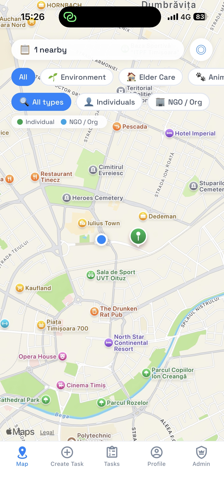
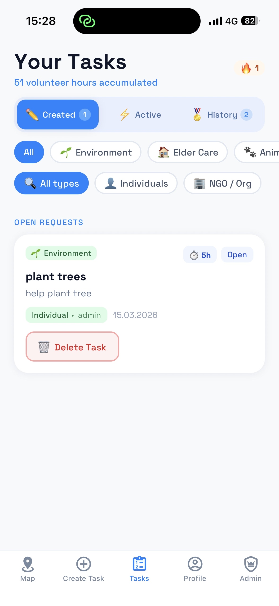
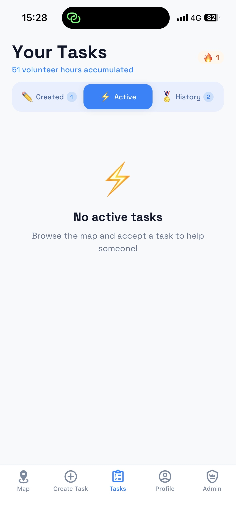
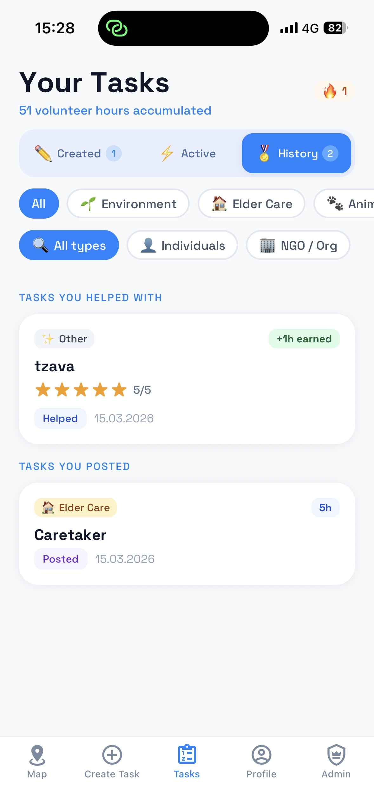
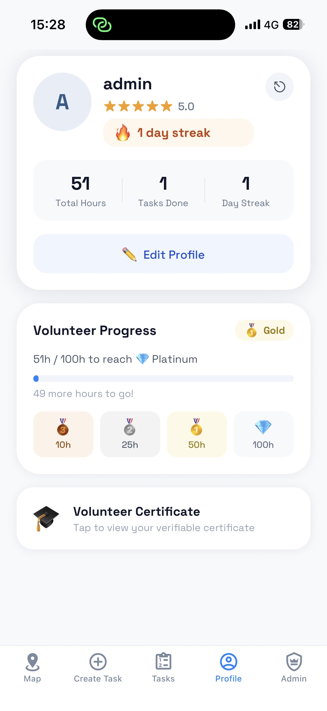

# 📱 App Name

O aplicatie care ajuta oamenii doritori de a face voluntariat fara a se inscrie intr-o organizatie negovernamentala.
---

# 📖 Description

Write a short description explaining the purpose of the application.

This application was developed to help users **[describe the main goal of the app]**.
Users can **[main action 1]**, **[main action 2]**, and **[main action 3]**.

The goal of the project is to provide a **simple, intuitive, and efficient mobile experience** while demonstrating modern mobile development practices.

---

# 📱 Pages

Ce contine aplicatia?

---

## Home

<p align="center">
  
</p>
---

## Create Task

<p align="center">
  
</p>
---

## Task Page

<p align="center">
  
  
  
</p>

Description of what happens on this page.

---

## Profile

<p align="center">
  
</p>

Description of what happens on this page.

---

## 

<p align="center">
  
</p>

Description of what happens on this page.

---


# ⚙️ Technical Information

## Technologies Used

* Programming Language: [e.g. Kotlin / Swift / Dart / JavaScript]
* Framework: [e.g. Flutter / React Native / Android SDK / SwiftUI]
* Backend: [e.g. Firebase / Node.js / Django]
* Database: [e.g. SQLite / Firestore / PostgreSQL]

---

## Architecture

The application follows a **[MVC / MVVM / Clean Architecture / other]** structure.

Main components include:

* **UI Layer** – handles user interface and user interactions
* **Business Logic Layer** – manages the application logic
* **Data Layer** – handles data storage and retrieval

---

## Features

* User authentication
* Profile management
* Data persistence
* Responsive mobile UI
* Error handling and validation

---

# 📂 Project Structure

```
project-name
│
├── README.md
├── screenshots
│   ├── home.png
│   ├── page1.png
│   ├── page2.png
│   └── page3.png
│
├── src
│   └── application source code
```

---

# 👥 Authors

* Your Name
* Teammate Name
* Teammate Name

---

# 📄 License

This project is licensed under the **MIT License**.
