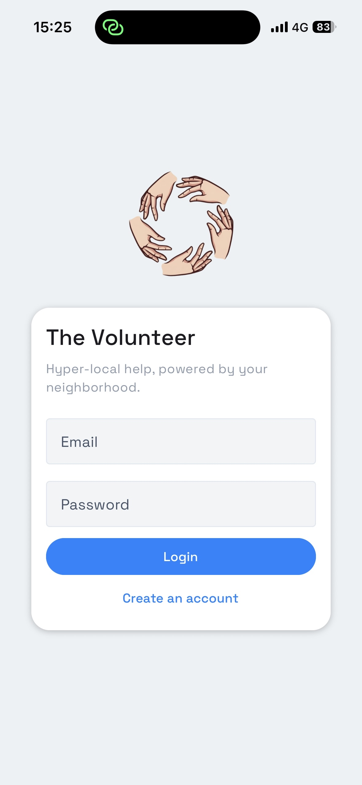
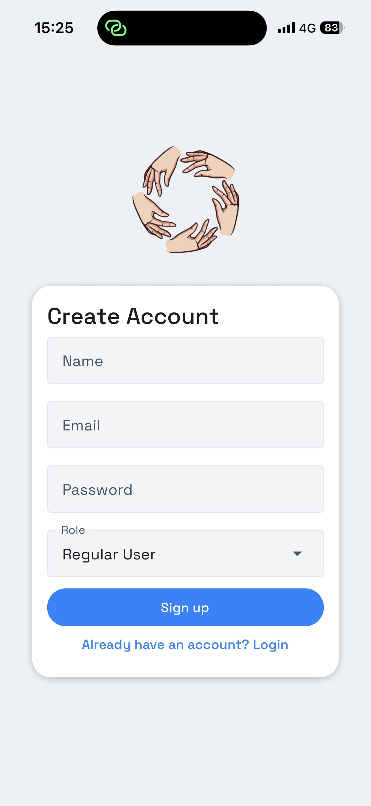
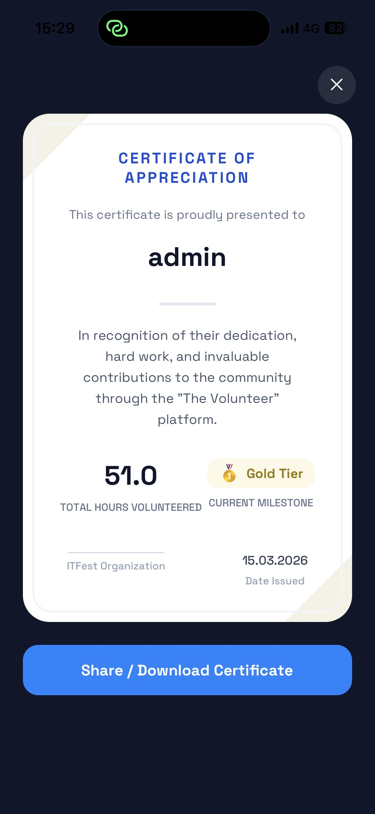

# The Volunteer

Hyper-local help platform that connects people who need support with nearby volunteers.


## Quick Overview

The Volunteer is a mobile app where users can:

- Create local help requests with category, details, and map location.
- Discover nearby open tasks on the map.
- Accept tasks and complete them.
- Receive volunteer hours based on task rating.
- Track streaks, ratings, and milestone progress.
- Access admin tools for moderation and operations.

## Demo

<p align="center">
	
	
</p>

## Screenshots

<p align="center">
	
	
	
</p>

<p align="center">
	
	
	
</p>

<p align="center">
	
	
</p>

## Tech Stack

### Mobile App

- Expo
- React Native + TypeScript
- React Navigation
- React Native Paper
- Expo Location
- Expo Notifications
- React Native Maps

### Backend

- Firebase Authentication
- Cloud Firestore
- Firebase Cloud Functions (Node.js 20)

## Project Structure

```text
itfest-the-volunteer/
	screenshots/
	the-volunteer/
		src/
			components/
			screens/
			hooks/
			services/
			firebase/
			navigation/
			utils/
		functions/
			src/
```

## Getting Started

### 1. Clone Repository

```bash
git clone <your-repo-url>
cd itfest-the-volunteer
```

### 2. Install Dependencies

```bash
cd the-volunteer
npm install
npm run functions:install
```

### 3. Environment Variables

Create a file named .env inside the-volunteer and add:

```bash
EXPO_PUBLIC_FIREBASE_API_KEY=
EXPO_PUBLIC_FIREBASE_AUTH_DOMAIN=
EXPO_PUBLIC_FIREBASE_PROJECT_ID=
EXPO_PUBLIC_FIREBASE_STORAGE_BUCKET=
EXPO_PUBLIC_FIREBASE_MESSAGING_SENDER_ID=
EXPO_PUBLIC_FIREBASE_APP_ID=
```

Optional for Cloud Functions admin signup flow:

- Set ADMIN_SECRET_PASSWORD in Functions environment.

### 4. Run Mobile App

```bash
npm start
```

You can also use:

- npm run ios
- npm run android
- npm run web

### 5. Build Functions

```bash
npm run functions:build
```

## Available Scripts

From the-volunteer:

- npm start
- npm run ios
- npm run android
- npm run web
- npm run typecheck
- npm run functions:install
- npm run functions:build

From the-volunteer/functions:

- npm run build
- npm run serve
- npm run deploy

## Architecture Notes

- Authentication is handled with Firebase Auth.
- User and task data are stored in Firestore.
- Task status transitions (accept, complete/rate) are protected by Cloud Functions.
- Push notifications are sent via Firestore triggers and FCM tokens.

## Current Feature Set

- Auth: login/signup with optional admin role request.
- Task map: nearby filtering by category and requester type.
- Task management: created, active, and history tabs.
- Volunteer profile: rating, streak, milestone progression.
- Certificate screen with share action.
- Admin dashboard: user moderation and task oversight.

## Roadmap

- Finalize full credits to volunteer-hours naming migration.
- Improve certificate issuing workflow and request limits.
- Extend analytics and admin tooling.
- Continue UI consistency polish.

## Contributing

1. Create a feature branch.
2. Commit your changes with clear messages.
3. Open a pull request with screenshots for UI changes.

## License

Add your license here (MIT, Apache-2.0, or project-specific).
